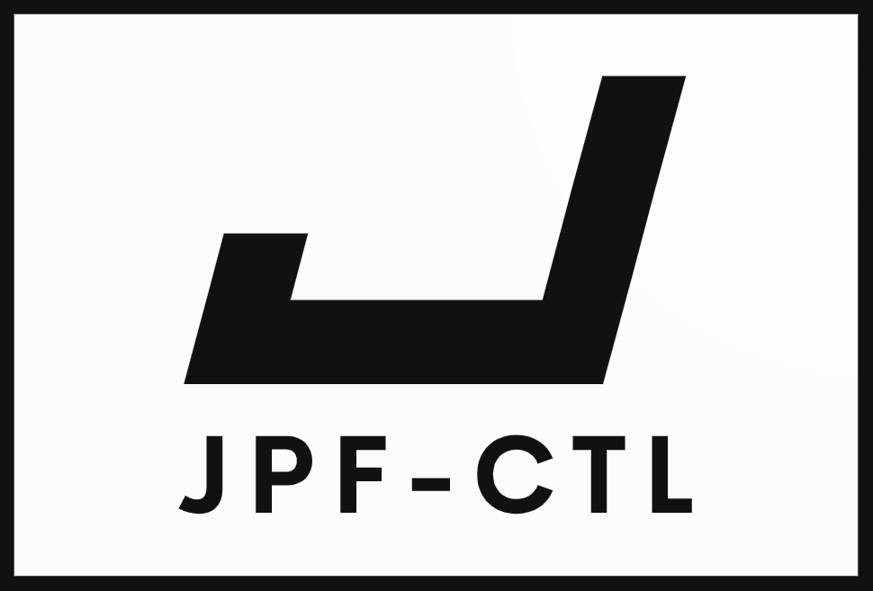

<!-- PROJECT LOGO -->
<p align="center">
    
</p>

- [About jpf-ctl](#About-jpf-ctl)
  - [Limitations](#Limitations)
- [Installation instructions for using jpf-ctl](#Installation-instructions-for-using-jpf-ctl)
  - [Java](#Java)
  - [Git](#Git)
  - [Java PathFinder (jpf-core)](#Java-PathFinder-%28jpf-core%29)
  - [jpf-label](#jpf-label)
  - [jpf-ctl](#jpf-ctl)
- [Installation instructions for developing jpf-ctl](#Installation-instructions-for-developing-jpf-ctl)
  - [ANTLR4](#ANTLR4)
  - [jpf-nhandler](#jpf-nhandler)
- [Using jpf-ctl](#Using-jpf-ctl)
- [Contributing to jpf-ctl](#Contributing-to-jpf-ctl)
- [License](#License)
- [Contact](#Contact)

## About jpf-ctl

The most common approach to finding errors in software is testing. However, testing is of limited use when checking *concurrent software* for errors. Hence, other techniques, including *model checking*, have been developed to supplement testing. We focus on Java as Java is one of the most widely used programming languages. Presently, the most popular tool for model checking of Java code, [*Java PathFinder*](https://github.com/javapathfinder) (JPF), does not support the checking of properties expressed in temporal logics; instead, it checks properties such as deadlocks and data races. To resolve this, we present jpf-ctl, an extension of JPF which supports the checking of properties specified in *computational tree logic* (CTL). 

Let us consider a simple example. The class [Account](code/jpf-ctl/src/main/java/example/Account.java) models a bank account.  The classes [Deposit](code/jpf-ctl/src/main/java/example/Deposit.java) and [Withdraw](code/jpf-ctl/src/main/java/example/Withdraw.java) are threads that deposit to and withdraw from a bank account.  The class [Main](code/jpf-ctl/src/main/java/example/Main.java) is an app that creates a single bank account and multiple threads that deposit to and withdraw from that bank account.  It takes three command line arguments:
- the initial balance of the bank account,
- the number of Deposit threads that do one deposit transaction to the bank account, and
- the number of Withdraw threads that do one withdrawal transaction to the back account.

The withdraw method of the Account class
```java
public boolean withdraw(double amount) {
  if (amount < 0) {
    throw new IllegalArgumentException("A negative amount cannot be withdrawn");
  }
  if (this.balance >= amount) {
    this.balance -= amount;
    return true;
  } else {
    return false;
  }
}
```
attempts to ensure that the balance never becomes negative. However, as the method is not synchronized, the balance may become negative. The Main class contains a static boolean field named negative which captures whether the balance of the account is negative. This field is regularly updated in the app.

The JUnit test [AccountTest](code/jpf-ctl/src/main/java/example/AccountTest.java), which performs one million runs of the app with an initial balance of one, two Deposit threads, and two Withdraw threads, does *not* detect a negative balance. The property that the balance never becomes negative can be captured by the CTL formula AG !example.Main.negative. This formula specifies that for every run of the Java code (*A* stands for "for all"), and for every state of such a run (*G* stands for "globally"), the static boolean field example.Main.negative is false (! represents negation). As will be shown in the demo below, jpf-ctl is *successful* in determining that the CTL formula does not hold for this Java app, that is, the balance can become negative, and jpf-ctl will provide a counterexample that shows why the CTL formula does not hold.

### Limitations

Since jpf-ctl relies on jpf-core, the core of JPF, and jpf-core currently supports Java 8, only apps that use Java 8 constructs can be checked. Furthermore, jpf-core can only handle apps, that is, it needs a main method of a class as its starting point. Currently, jpf-ctl only supports static boolean fields as the basic building blocks of CTL formulas.

## Installation instructions for using jpf-ctl

### Java

Use [Java](https://www.oracle.com/ca-en/java/technologies/javase/javase8-archive-downloads.html)'s version 8 (we have successfully used 1.8.0_251, 1.8.0_281, and 1.8.0_301).  To check which version of Java (if any) is currently in use, issue the following command.
```
> java -version
java version "1.8.0_251"
Java(TM) SE Runtime Environment (build 1.8.0_251-b08)
Java HotSpot(TM) 64-Bit Server VM (build 25.251-b08, mixed mode)
```

### Git

To check if any version of [Git](https://git-scm.com/downloads) is currently in use, issue the following command.
```
> git --version
git version 2.26.2.windows.1
```

### Java PathFinder (jpf-core)

Install [jpf-core](https://github.com/javapathfinder/jpf-core) following the instructions on the [jpf-core wiki](https://github.com/javapathfinder/jpf-core/wiki/How-to-install-JPF). We recommend cloning the master branch using Git and building JPF with the Gradle wrapper. Note that some tests may fail. This should not prevent you from using JPF.

### jpf-label

1. Clone [jpf-label](https://github.com/javapathfinder/jpf-label) using Git: go the directory where you want to put jpf-label and issue the following command.
```
> git clone https://github.com/javapathfinder/jpf-label.git
Cloning into 'jpf-label'...
remote: Enumerating objects: 153, done.
remote: Counting objects: 100% (153/153), done.
remote: Compressing objects: 100% (84/84), done.
Receiving objects:  75% (115/153)sed 141 (delta 58), pack-reused 0
Receiving objects: 100% (153/153), 107.48 KiB | 1.28 MiB/s, done.
Resolving deltas: 100% (67/67), done.
```
2. Build jpf-label with the Gradle wrapper: inside the jpf-label directory, issue the following command.
```
> .\gradlew

> Task :compileJava
Note: C:\Users\montreal\Downloads\jpf-label\src\main\label\StateLabel.java uses unchecked or unsafe operations.
Note: Recompile with -Xlint:unchecked for details.

BUILD SUCCESSFUL in 47s
4 actionable tasks: 4 executed
```
3. Add
```
jpf-label=<path to jpf-label's directory>
```
to JPF's site.properties file.

### jpf-ctl

1. Clone jpf-ctl using Git: go the directory where you want to put jpf-ctl and issue the following command.

```
> git clone https://github.com/Lassonde-JPF/jpf-ctl.git
Cloning into 'jpf-ctl'...
remote: Enumerating objects: 3159, done.
remote: Counting objects: 100% (1816/1816), done.
remote: Compressing objects: 100% (1061/1061), done.
remote: Total 3159 (delta 875), reused 1548 (delta 639), pack-reused 1343
Receiving objects: 100% (3159/3159), 14.39 MiB | 1.17 MiB/s, done.
Resolving deltas: 100% (1491/1491), done.
```
2. Build jpf-ctl with the Gradle wrapper: inside the jpf-ctl directory, issue the following command.
```
> .\gradlew

BUILD SUCCESSFUL in 25s
6 actionable tasks: 6 executed
```
3. Add
```
jpf-ctl=<path to jpf-ctl's directory>
```
to JPF's site.properties file.

## Installation instructions for developing jpf-ctl

Start with [these](#Installation-instructions-for-using-jpf-ctl) instructions.  Continue with the following. 

### ANTLR4 

Install [ANTLR4](https://github.com/antlr/antlr4/blob/master/doc/getting-started.md) (we have successfully used version 4.9.2).  ANTLR4 is used to parse CTL formulas.

### jpf-nhandler

1. Clone [jpf-nhandler](https://github.com/javapathfinder/jpf-nhandler) using Git: go the directory where you want to put jpf-nhandler and issue the following command.

```
> git clone https://github.com/javapathfinder/jpf-nhandler.git
Cloning into 'jpf-nhandler'...
remote: Enumerating objects: 1954, done.
remote: Counting objects: 100% (1954/1954), done.
remote: Compressing objects: 100% (628/628), done.
remote: Total 1954 (delta 1152), reused 1932 (delta 1138), pack-reused 0
Receiving objects:  99% (1935/1954), 8.25 MiB | 1.17 MiB/s
Receiving objects: 100% (1954/1954), 8.81 MiB | 1.17 MiB/s, done.
Resolving deltas: 100% (1152/1152), done.
```
2. Build jpf-nhandler with the Gradle wrapper: inside the jpf-nhandler directory, issue the following command.
```
> .\gradlew

> Task :compileJava
C:\Users\montreal\Downloads\tmp\jpf-nhandler\src\main\java\nhandler\conversion\jpf2jvm\JPF2JVMGenericConverter.java:227: warning: sun.reflect.ReflectionFactory is internal proprietary API and may be removed in a future release
        ctor = sun.reflect.ReflectionFactory.getReflectionFactory().newConstructorForSerialization(cl, Object.class.getConstructor());
                          ^
Note: Some input files use unchecked or unsafe operations.
Note: Recompile with -Xlint:unchecked for details.
1 warning

BUILD SUCCESSFUL in 29s
4 actionable tasks: 4 executed
```
3. Add
```
jpf-nhandler=<path to jpf-nhandler's directory>
```
to JPF's site.properties file.

JPF's extension jpf-nhandler is used to test a listener of jpf-ctl.

## Documentation

Documentation for jpf-ctl can be found within the [documentation](/documentation/) directory.  The PDF version can be directly accessed using the following 
[link](/documentation/report.pdf).

## Using jpf-ctl

<< how to use >>

## Contributing to jpf-ctl

If you wish to contribute to jpf-ctl by addressing some of the [open issues](https://github.com/Lassonde-JPF/jpf-ctl-extension/issues) or suggesting new features, please note that we do not have time to review minor changes such as variable renames, spelling mistakes, etc. If you would wish to point these out, please create an issue rather than a pull request.

1. Fork ctl-jpf. 
2. Create your feature branch (`git checkout -b feature/AmazingFeature`).
3. Commit your changes (`git commit -m 'Add some AmazingFeature'`).
4. Push to the branch (`git push origin feature/AmazingFeature`).
5. Open a pull request.

## License

Distributed under the GNU General Public License v3. See [LICENSE](LICENSE.md) for more information.

## Contact

The following contacts are responsible for the development and management of jpf-ctl.

### Development Team

**Parssa Khazra** - [ParssaKhazra](https://github.com/ParssaKhazra)  
**Anto Nanah Ji** - [antoNanahJi](https://github.com/antoNanahJi)  
**Matt Walker** - [matthewwalk](https://github.com/matthewwalk)  
**Hongru Wang** - [HongruWang](https://github.com/HongruWang-123)  
**Franck van Breugel** - [franck-van-breugel](https://github.com/franck-van-breugel)

